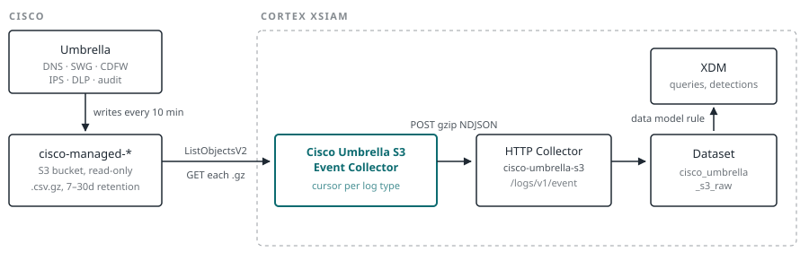
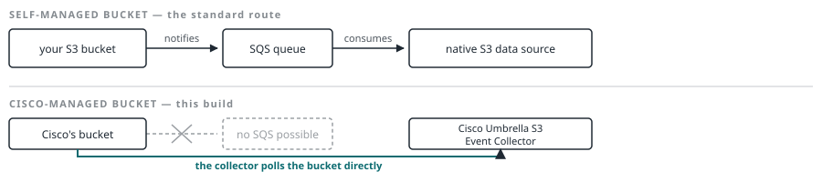

# Deployment Guide: Cisco Umbrella → XSIAM Collector 

**A custom event collector that reads Cisco Umbrella logs straight out of the Cisco-managed S3 bucket by polling it — every log type, every licence tier. No SQS queue, no S3 bucket of your own, no Lambda.**

**Source** s3://cisco-managed-&lt;region&gt;/&lt;orgid&gt;_&lt;hash&gt;/ · **Dataset** cisco_umbrella_s3_raw · **Time** ~45 min + one fetch cycle

> 💡 **Tip** — The checkboxes below are visual only in GitHub's file view. To tick them off as you work,
> copy this page into a tracking issue — checkboxes are interactive there.

---

## Contents

- [How it works, and why it's built this way](#how-it-works-and-why-its-built-this-way)
- [00 · What you need before you start](#00--what-you-need-before-you-start)
- [01 · Collect the bucket credentials](#01--collect-the-bucket-credentials)
- [02 · Upload the integration](#02--upload-the-integration)
- [02b · Create the HTTP Collector](#02b--create-the-http-collector)
- [03 · Configure the instance](#03--configure-the-instance)
- [04 · Discover your log types and check the columns](#04--discover-your-log-types-and-check-the-columns)
- [05 · Let it fetch, then find the dataset](#05--let-it-fetch-then-find-the-dataset)
- [06 · Add the data model rule](#06--add-the-data-model-rule)
- [07 · Decide about DNS logs](#07--decide-about-dns-logs)
- [08 · Alert on silence](#08--alert-on-silence)
- [When it doesn't work](#when-it-doesnt-work)
- [XQL library](#xql-library)
- [Build & test — only if you change the code](#build--test--only-if-you-change-the-code)

## How it works, and why it's built this way

*Written for engineers who know S3 and HTTP but have never configured XSIAM. Every Cortex-specific term used later is defined here.*

Cisco Umbrella can export its logs to an S3 bucket. You get two choices: a bucket you own, or a bucket Cisco owns and manages for you. This guide covers the second, because it needs no AWS account of your own — Cisco hands you a bucket path and a read-only key pair, and that's the entire integration surface.

<picture>
  <source media="(prefers-color-scheme: dark)" srcset="docs/architecture-dark.svg">
  
</picture>

*The whole path. Umbrella writes gzipped CSV on its own schedule; nothing pushes to XSIAM, so the Cisco Umbrella S3 Event Collector (teal) has to go and look. Everything right of the collector is standard XSIAM plumbing you configure once.*

### What each piece is for

**The Cisco-managed bucket** — *Cisco side*  
Umbrella drops one gzipped CSV per log type roughly every 10 minutes, into date folders under your org prefix. You get read-only keys for your prefix and nothing else — you cannot configure the bucket, only read it. Retention is 7, 14 or 30 days; past that the data is gone.

**The event collector** — *XSIAM · custom content*  
A Python integration you upload. On a timer it lists new objects, downloads and un-gzips them, turns each CSV row into a JSON object with named fields, and posts them onward. It remembers its position per log type, so each run picks up where the last stopped.

**The HTTP Collector** — *XSIAM · ingestion*  
A generic ingestion endpoint: anything that can POST JSON can feed XSIAM through it. Its *vendor* and *product* settings decide the dataset name. It exists here because a custom integration is not permitted to write to a dataset directly (see below).

**The dataset** — *XSIAM · storage*  
A table in the data lake, named `<vendor>_<product>_raw`. Every field the collector sends is stored and searchable with XQL, Cortex's query language, whether or not it is mapped to anything.

**Data model rules and XDM** — *XSIAM · normalisation*  
XDM is Cortex's common schema. A data model rule maps vendor fields onto XDM ones — `domain` becomes `xdm.network.dns.dns_question.name` — so a query or detection written once matches Umbrella, your firewall and your endpoints alike. Optional: skip it and the raw data still queries fine.

**The instance** — *XSIAM · scheduling*  
One configured copy of the integration: credentials, which log types, how often to run. You can run several instances of the same integration — one per Umbrella org, for example — each with its own cursor.

### Two design decisions worth understanding before you start

**Why polling and not the built-in S3 data source.** XSIAM's native Amazon S3 collection is notification-driven: the bucket publishes an `s3:ObjectCreated` event to an SQS queue and XSIAM consumes that queue. Only a bucket's owner can configure notifications, and these buckets belong to Cisco. Your key is read-only on your own prefix, so there is no SQS queue to create and nothing to subscribe to. The alternative is switching Umbrella to a bucket you own and building the queue — which is what Palo Alto's Terraform module does, and precisely what this avoids.

<picture>
  <source media="(prefers-color-scheme: dark)" srcset="docs/why-polling-dark.svg">
  
</picture>

*The one edge that changes. Bucket notifications can only be set by the bucket's owner, so the top route is unavailable — the collector replaces both the notification and the queue with a polling loop and a saved cursor.*

**Why events take an indirect route into XSIAM.** XSIAM gives integration authors a built-in shortcut for writing events into a dataset: a function called `send_events_to_xsiam()`. It would be the obvious thing to use here, and it is not available to us.

Palo Alto restricts that function to *system content* — integrations that ship with the platform or come from the official Marketplace. Anything you write yourself and upload through the console is *custom content*, and calling the function from custom content fails immediately with:

```
command 'getLicenseCustomField' is only available for system content
```

The function needs to read a licence detail that only system content is permitted to see, so it never gets as far as sending anything.

This collector therefore uses the platform's other supported entrance: an **HTTP Collector**. That is a general-purpose ingestion endpoint you create in XSIAM in about a minute. It gives you a URL and an API key; anything that can make an HTTPS request and send JSON can feed data into XSIAM through it. No privileged calls are involved, and it is a documented, first-class route rather than a workaround.

**The one thing this costs you.** XSIAM credits ingested volume to whatever delivered it. Because the HTTP Collector is what delivers here, *its* row under Data Sources shows your event counts, while the integration's own "Count Received" column stays empty — even though the integration is doing all the work. The data itself is identical either way; only the bookkeeping differs. Monitor the collector's row, not the integration's.

<details>
<summary><b>How the collector knows what it has already read</b></summary>

Per log type it stores a cursor — an object key marker — plus a ring buffer of the last 4,000 keys it processed. Each run lists objects after the marker, skips anything in the ring, and processes the rest.

The marker deliberately lags the newest object by 30 minutes. Umbrella object names end in a random suffix (`…-00-05-aaaa`, `…-00-05-zzzz`), so a file uploaded slightly late can sort *before* one already processed. A cursor parked at the highest key seen would step over it and never look back — silently. The 30-minute overlap is re-listed every run and de-duplicated against the ring buffer.

State is saved after every push, not once at the end, so a run that dies mid-backfill keeps what it delivered. Delivery is at-least-once: dedupe on `s3_key` plus the row if exactness matters to you.

</details>

<details>
<summary><b>Which log types your licence gives you</b></summary>

| Folder | Contents | Requires |
|---|---|---|
| dnslogs | Every DNS query and its verdict | Any Umbrella licence — and by far the highest volume |
| auditlogs | Admin actions in the Umbrella dashboard | Any licence. Written only when someone changes something |
| proxylogs | Full URL, method, status, file hashes, AMP verdicts | SIG or Secure Web Gateway |
| firewalllogs  cloudfirewalllogs | L3/L4 connections, verdicts, byte counts | Cloud Delivered Firewall. Both folder names occur |
| intrusionlogs | IPS signature hits | CDFW with IPS |
| dlplogs | DLP rule matches, file and classification detail | Umbrella DLP |
| iplogs | IP-layer enforcement sessions | IP-layer enforcement enabled |

The collector ships column layouts for all seven at Umbrella log schema v13, and the data model rule file has a block for each. You don't need to know in advance which you have — Phase 04 discovers it from the bucket.

</details>

## 00 · What you need before you start

`BOTH CONSOLES`

*Two admin sessions and two files. Nothing is installed on-premises and no AWS account of your own is involved.*

- **XSIAM role** — an admin role that can create integration instances and edit data-management content. On a stock tenant that's *Instance Administrator*; on a custom role you need `Automation & Feed Integrations` and `Data Management` both set to Read/Write. Without them the upload control simply won't render.

- **Umbrella role** — Full Admin on the Umbrella org, which is what gates `Admin → Log Management` and key rotation.

- **Two files** — `CiscoUmbrellaS3EventCollector.yml` (the integration) and `CiscoUmbrellaS3ModelingRules.xif` (the XDM mapping).

- **Egress** — only matters if you run the integration on your own engine rather than the tenant: outbound TCP/443 to `cisco-managed-<region>.s3.<region>.amazonaws.com` and to your tenant's API host.

## 01 · Collect the bucket credentials

`UMBRELLA`

*The Umbrella dashboard is the only place these keys exist — it shows the secret once and never stores it.*

- [ ] **Open `Admin → Log Management`**

  Confirm the org is set to *Use a Cisco-managed S3 bucket*, and note two things: the **region** and the **retention period** (7, 14 or 30 days). Retention is your hard ceiling for backfill — you cannot fetch anything older.

- [ ] **Split the S3 URI into bucket and prefix**

  The collector takes them separately, with no slashes and no `s3://`. From `s3://cisco-managed-us-west-1/1234567_a1b2…a9b0/`:

  |   |   |
  |---|---|
  | Bucket | cisco-managed-us-west-1 |
  | Bucket Prefix | 1234567_a1b2c3d4e5f6a7b8c9d0e1f2a3b4c5d6e7f8a9b0 |
  | Region | leave blank — derived from the bucket name |

- [ ] **Get the access key and secret**

  If you still have the pair from when logging was enabled, use it. If the secret is lost, the only route is *Rotate keys* — Umbrella will not re-display an old secret. The access key is 20 characters, the secret exactly **40**.

  > ⚠️ **Warning — Rotation is immediate and global.** The old key stops working the moment you rotate, breaking any other tool reading this bucket in the same instant. **Cisco also requires rotation every 90 days** — an un-rotated key loses access even though Umbrella keeps writing data.

## 02 · Upload the integration

`XSIAM`

*A single YAML carries both the configuration screen and the Python. There is nothing to install from the Marketplace.*

- [ ] **Go to `Settings ⚙ → Data Sources & Integrations` → **+ Add New** → **Create Integration****

  Two routes appear: *Import File* (drag the YAML in) and *Create from Template* (the built-in code editor).

- [ ] **Import `CiscoUmbrellaS3EventCollector.yml`**

  Re-importing the same file later is how you ship code changes — it overwrites in place and keeps existing instances and their cursors.

  > ⚠️ **Warning — The YAML must be built, not hand-edited.** The build script strips the three `import demistomock` / `CommonServerPython` lines before embedding the code, exactly as `demisto-sdk unify` does. XSIAM injects those bindings around your script at runtime and there is no `demistomock` package in the container, so a YAML that still contains that import fails on Test with `ModuleNotFoundError: No module named 'demistomock'`.

  > 📝 **Note** — Adding a **required** parameter to an integration that already has instances breaks the import: XSIAM re-initialises every instance against the new schema and fails on the missing value. If you extend this integration, add new fields as optional and validate them in code.

- [ ] **Confirm it registered**

  Search the list for **Cisco Umbrella S3 Event Collector**. It should show as custom content with no instances yet.

## 02b · Create the HTTP Collector

`XSIAM`

*The receiving end. It must exist before the instance is configured, because the instance needs its URL and key.*

- [ ] **Add a custom HTTP collector with exactly these settings**

  `Settings → Data Sources & Integrations → + Add New`, choose the custom / HTTP option.

  | Field | Value | Why |
  |---|---|---|
  | Name | cisco-umbrella-s3 | Free text — only a label in the data-source list. |
  | Compression | gzip | The integration gzips every batch and sends `Content-Encoding: gzip`. A mismatch fails with `gzip compression error (invalid header)`. |
  | Log Format | JSON | Each batch is newline-delimited JSON — one flat object per line, one event per object. |
  | Vendor | cisco | Together these name the dataset `cisco_umbrella_s3_raw`. Change either one and the data model rule and every query here point at a dataset that never fills. |
  | Product | umbrella_s3 |

  If your collector already exists as *uncompressed*, don't recreate it — tick *Send uncompressed* in the instance's advanced settings instead.

- [ ] **Copy the URL and the API key together**

  The URL is your tenant's API host with `/logs/v1/event` on the end — `https://api-<tenant>.xdr.<region>.paloaltonetworks.com/logs/v1/event`. A real one reads like
  `https://api-acmecorp.xdr.us.paloaltonetworks.com/logs/v1/event`, where `acmecorp` is your tenant name and `us` your region (`eu`, `uk`, `apac`, `ca`, `sg`, `jp`, `au` are the others). Copy it from the collector rather than typing it. The key is shown **once** — if it's lost, delete the collector and make a new one. They are a matched pair; a URL from one collector and a key from another returns 401.

- [ ] **(Optional) Prove the collector works before wiring anything to it**

  This sends one row in exactly the shape the integration uses — same gzip, same NDJSON, same headers.

  *shell · one test event*

  ```bash
  URL='https://api-<tenant>.xdr.<region>.paloaltonetworks.com/logs/v1/event'
  KEY='<collector api key>'

  printf '%s\n' '{"source_log_type":"collector-test","domain":"test.invalid"}' \
    | gzip \
    | curl -sS -i -X POST "$URL" \
        -H "Authorization: $KEY" \
        -H "Content-Type: application/json" \
        -H "Content-Encoding: gzip" \
        --data-binary @-
  ```

  Expect `200`. A `401`/`403` means the key is wrong or mismatched with the URL; a `400` or a gzip error means Compression or Log Format doesn't match what you sent.

  > 📝 **Note** — No shell to hand? Postman works, without gzip: same URL, `Authorization` and `Content-Type: application/json` headers, raw JSON body, no `Content-Encoding`. Then **400 or a gzip error means the key is good** — the collector authenticated you and only rejected the format. Only 401 points at the credential.

## 03 · Configure the instance

`XSIAM`

*One instance per Umbrella org. The screen mixes this integration's own settings with platform fields XSIAM shows on every integration — most of the latter do nothing here.*

### Settings this integration defines

| Field | Default | What it does |
|---|---|---|
| S3 bucket | cisco-managed-us-west-1 | The Cisco-managed bucket from Umbrella Log Management. Other regions exist, e.g. `cisco-managed-eu-west-1`. |
| Bucket prefix | required | Your org folder, `<orgid>_<40-char hash>`. No `s3://`, no slashes. |
| AWS region | derived | Blank means take it from the bucket name. Set it only if your bucket name doesn't carry the region. |
| Access key / secret | required | From Umbrella. Secret is exactly 40 characters. |
| HTTP Collector URL | required | From Phase 02b — the API URL shown when the collector was created. Full form: `https://api-<tenant>.xdr.<region>.paloaltonetworks.com/logs/v1/event`, e.g. `https://api-acmecorp.xdr.us.paloaltonetworks.com/logs/v1/event`. Must end `/logs/v1/event`. Optional in the schema so that importing an updated YAML never breaks an existing instance — but nothing sends without it. |
| HTTP Collector API key | required | The key from the same collector as the URL above. |
| Log types | auto | `auto` discovers every folder under your prefix — right for a first run, and it adapts to any licence. Pin the list explicitly for production so a newly licensed log type can't start ingesting unnoticed. |
| First fetch time | 3 days | How far back the first run starts; ignored afterwards. Cannot exceed bucket retention. This is how much history you ingest and pay for. |
| Max objects per fetch | 100 | Per log type. Umbrella writes ~144 files/day/type, so 100 is ample steady-state. Raise to 500–1000 while backfilling. |
| Max events per fetch | 200000 | Per log type. Usually the *real* throttle — one busy DNS file holds tens of thousands of rows, so this stops the run long before the file count does. Raise both together. |
| Max run time (seconds) | 240 | The collector stops cleanly here and resumes next run, instead of being killed by the container timeout (which leaves the instance red). Keep below your tenant script timeout. |
| Column overrides (JSON) | empty | Override the CSV column order per log type when Cisco bumps the schema. Position 1 names column 1. |
| Send uncompressed | off | Only if the HTTP Collector was created with Compression = uncompressed. |
| Trust any certificate | off | Standard TLS bypass. Leave off. |
| Use system proxy settings | off | Tick if the engine reaches AWS through a proxy. |

### Platform fields XSIAM shows on every integration

These belong to the platform, not to this integration. The screen renders them whether or not they apply, which is a common source of confusion.

| Field | Set it to | Why |
|---|---|---|
| Fetch events | ✔ on | **The one that matters.** Without it the integration loads but never runs on a timer — Test passes, nothing ingests. |
| Events fetch interval | 5–10 min | Umbrella writes every ~10 minutes, so anything under 5 buys nothing. A new run cannot start while the previous is still going, so long runs effectively serialise. |
| Fetch incidents / Fetch issues | off | For integrations that create cases from alerts. This is an event collector — it writes to a dataset, it does not raise issues. Leave off or it will simply do nothing. |
| Fetch indicators | off | For threat-intel feeds populating the indicator store. Not applicable. |
| Classifier / Mapper / Incident type | none | These shape fetched *incidents* into case fields. With no incidents fetched they are inert. Normalisation here happens in the data model rule instead (Phase 06). |
| Run on | tenant / default | Where the container executes. Pick an engine only if policy requires the AWS call to leave from your network — and then tick the proxy option if that engine needs one. |
| Log level | Debug while installing | Debug prints the per-run lines you need — how many objects were listed, how many events sent. Drop it back afterwards. |
| Instance name | e.g. umbrella-s3-prod | Identifies it in logs and health views. One per Umbrella org. |
| Do not use by default | off | Marks an instance as on-demand only for playbook commands. Irrelevant to fetching. |
| Single engine / Engine group | none | Only relevant when running on engines. |

A pass means the credentials work and at least one log folder exists under your prefix. It does *not* prove the HTTP Collector settings are right — that comes in Phase 05. Anything else is in the [troubleshooting table](#tr).

## 04 · Discover your log types and check the columns

`XSIAM`

*The sample command reads real objects without pushing anything or moving the cursor — the safe way to see what you have and confirm the layout matches.*

- [ ] **List what actually exists under your prefix**

  *command · discover and sample every folder*

  ```
  !cisco-umbrella-s3-get-events log_type=auto limit=1
  ```

  This is your licence inventory: whatever folders come back are what Umbrella is writing for your org. Write the list down — Phase 06 needs it. The debug log also prints `Discovered log types: [...]`.

- [ ] **Check the fields landed in the right places**

  *command · sample one log type*

  ```
  !cisco-umbrella-s3-get-events log_type=dnslogs limit=1
  ```

  For `dnslogs`: `domain` should hold a domain, `action` should read `Allowed` or `Blocked`, `categories` should look like categories rather than an IP. For `proxylogs`, `url` should hold a URL. Trailing `col_16`, `col_17`… fields are the safety net firing: your schema has more columns than the built-in layout and nothing was dropped.

  > 📝 **Note** — Sample `dnslogs` rather than `auditlogs` when you can. Audit logs are written only when an administrator changes something, so a quiet org returns *No entries* — which looks like a fault and isn't one. DNS files arrive every 10 minutes without fail.

- [ ] **If the columns are shifted, name them — don't edit code**

  Put the correct order into *Column overrides (JSON)* on the instance. It replaces the built-in layout for that log type only.

  *instance parameter · column overrides*

  ```json
  {
    "dnslogs": [
      "timestamp", "policy_identity", "identities", "internal_ip",
      "external_ip", "action", "query_type", "response_code", "domain",
      "categories", "policy_identity_type", "identity_types",
      "blocked_categories", "rule_id", "destination_country", "org_id"
    ]
  }
  ```

## 05 · Let it fetch, then find the dataset

`XSIAM`

*The dataset is created by the HTTP Collector on its first accepted batch. It does not exist before then — which is why the data model rule comes after this phase, not before.*

- [ ] **Force one push rather than waiting for the timer**

  *command · read one file and actually send it*

  ```
  !cisco-umbrella-s3-get-events log_type=dnslogs limit=1 should_push_events=true
  ```

  This is the fastest end-to-end proof: S3 read, parse, POST, dataset creation, all in one call.

- [ ] **Confirm rows landed**

  *XQL · did anything arrive*

  ```
  dataset = cisco_umbrella_s3_raw
  | comp count() as events by source_log_type
  ```

  Widen the time picker if it looks empty — with `first_fetch = 3 days` the first rows are backdated. A query against a dataset that has never received data returns nothing rather than an error, so an empty result doesn't distinguish "no data yet" from "wrong dataset name" — the collector's own row under Data Sources settles that.

## 06 · Add the data model rule

`XSIAM`

*Optional but valuable: maps Umbrella fields onto XDM so this data joins your other sources in one query. Everything stays searchable without it.*

- [ ] **Open `Settings → Configurations → Data Management → Data Model Rules`, **User Defined** tab**

  This is **one shared editor holding every user-defined rule in the tenant** — there is no per-rule Add button and no schema upload. Scroll to the bottom, leave a blank line, and paste from `CiscoUmbrellaS3ModelingRules.xif`.

  > ⚠️ **Warning — Copy the editor's existing contents out first.** It holds other teams' rules, and validation runs across the whole document — one bad field in your block blocks saving *everyone's*. Select all, paste into a local file, and you have a rollback.

- [ ] **Enable only the blocks for log types you actually ingest**

  The file has a block per log type; the DNS block is live and the rest are commented. Uncomment the ones matching the folders Phase 04 found.

  > ⚠️ **Warning — Two independent validators will reject a rule.** First, a field must exist in *your dataset* — a proxy block on a DNS-only org fails with `Data Model validation error - unknown field url`. Second, an XDM field must exist in *your tenant's XDM version*, which differs between tenants: `xdm.source.nat.ipv4 is not part of the selected data model`. The rule editor autocompletes after you type `xdm.`, and that list is authoritative — trust it over this guide.

  Each block keeps a conservative core live and lists richer fields in an EXTRAS comment. Move those up one at a time, saving after each.

- [ ] **Verify the mapping resolves**

  *XQL · blocked DNS through the data model*

  ```
  datamodel dataset = cisco_umbrella_s3_raw
  | filter xdm.event.type = "dns-request"
      and xdm.event.outcome = XDM_CONST.OUTCOME_FAILED
  | fields _time, xdm.source.host.hostname, xdm.source.user.username,
           xdm.network.dns.dns_question.name, xdm.event.description
  | limit 50
  ```

  Empty columns point at the mapping, not the collector — compare against the raw row for the same `s3_key` to see which side is missing the value.

## 07 · Decide about DNS logs

`XSIAM`

*Every other log type is modest. This is the one that needs a number attached before you commit.*

- [ ] **Size it from the bucket before ingesting a byte**

  One call against a full day of objects gives the compressed total; XSIAM bills on the uncompressed volume, and gzipped Umbrella CSV typically expands 8–12×.

  *shell · one day of DNS logs, compressed*

  ```bash
  aws s3 ls --summarize --recursive --human-readable \
    s3://cisco-managed-us-west-1/<your-prefix>/dnslogs/2026-08-28/ \
    --region us-west-1 | tail -3
  ```

  Multiply by ~10 and check against your licence headroom. If it lands somewhere uncomfortable, the lever is keeping only security-relevant rows — blocked verdicts are a small fraction of DNS traffic.

- [ ] **Backfill deliberately, then put the throttles back**

  For a catch-up: max objects 1000, max events 2000000, interval 1 minute. Afterwards: 100, 200000, 5–10 minutes. Left high, a long stall becomes one enormous burst.

  Raising the file limit alone usually changes nothing — the event cap is what stops the run. Raise both.

- [ ] **Know the ceiling**

  This is one Python process per run: download, gunzip, parse, POST. If sustained DNS volume outgrows it, the same listing logic runs as a container job posting to the same HTTP Collector — still no SQS, but it parallelises across processes.

## 08 · Alert on silence

`XSIAM`

*A polling collector fails quietly: no queue backs up, nothing errors downstream, the data just stops.*

- [ ] **Schedule the freshness query**

  *XQL · minutes behind, per log type*

  ```
  dataset = cisco_umbrella_s3_raw
  | comp max(_time) as newest by source_log_type
  | alter minutes_behind = divide(
      subtract(to_epoch(current_time(), "SECONDS"),
               to_epoch(newest, "SECONDS")), 60)
  | filter minutes_behind > 45
  ```

  Healthy is under ~20 minutes. Wire it into a scheduled correlation rule so a returned row raises an alert. Exclude `auditlogs` — it is legitimately quiet for hours.

- [ ] **Watch the collector row, not the integration row**

  Under Data Sources, the **HTTP Collector** shows the real received count. The integration's own "Count Received" column stays empty by design: because a custom integration can't use the platform's event API, it never registers as an ingestion source. The collector row is your monitoring signal.

- [ ] **Diarise the 90-day key rotation**

  Cisco requires it, and an un-rotated key loses bucket access while Umbrella keeps writing. Update the instance in the same change window. Retention is the safety net: fix it inside your window, widen *First fetch*, and nothing is lost.

- [ ] **Know how to stop it**

  Untick *Fetch events* to pause; the cursor is kept, so re-enabling resumes where it left off (within retention). Deleting the instance discards the cursor but leaves the dataset and everything ingested intact.

## When it doesn't work

*Errors surface on the instance's Test button and in the integration log. Use **Run Test & Download Debug Log** rather than plain Test — it shows whether a container started, which image, and the full request.*

| What you see | What it means | Fix |
|---|---|---|
| **ModuleNotFoundError: No module named 'demistomock'** | The YAML still contains the local-dev import lines. XSIAM injects those bindings at runtime; the package doesn't exist in the container. | Rebuild the YAML with the supplied build script, which strips them. Never hand-edit the embedded code. |
| **getLicenseCustomField is only available for system content** | Something called `send_events_to_xsiam()`, which is restricted to system content. | Use the HTTP Collector path — fill in the collector URL and key on the instance (Phase 02b). |
| **SignatureDoesNotMatch** | The AWS secret doesn't match the key. If the debug log shows AWS echoing back an identical StringToSign, every other input is correct and only the secret is wrong. | Check the secret is exactly 40 characters — a clipped paste is the usual cause. Re-enter it; clear the field first so the change registers. |
| **InvalidAccessKeyId** | The key ID doesn't exist — rotated in Umbrella, or past the 90-day limit. | Regenerate at Admin → Log Management and update the instance. |
| **AccessDenied** | Credentials valid but not for this path — wrong prefix, a leading slash, or keys from a different Umbrella org. | Prefix must be exactly the org folder, no `s3://`, no slashes. |
| **Connected, but no log folders were found** | Credentials and bucket are right; the prefix has nothing under it. | Check the prefix, or give Umbrella an upload cycle (~10 min) if logging was just enabled. |
| **HTTP Collector rejected the batch. HTTP 401** | Collector key wrong, or URL and key from different collectors. | The error reports the stored key's length and first/last characters — compare against the collector. Recreate and copy both together if unsure. |
| **gzip compression error (invalid header)** | The collector's Compression setting doesn't match what was sent. | Set the collector to gzip, or tick *Send uncompressed* on the instance. |
| **Timeout Error: Docker code script failed due to timeout** | The run exceeded the container limit. Nothing is lost — state commits per push — but the instance shows red and Last Communication stops updating, because only a clean finish counts. | Lower *Max run time per fetch* below the tenant timeout, or reduce the event cap. Status clears on the next successful run. |
| **Test passes, no events arrive** | *Fetch events* unticked, the collector URL/key blank, or the selected log types don't exist for this org. | Set Log types to `auto` for one cycle to see what's really there, then pin the list. |
| **Data Model validation error - unknown field X** | The rule references a field your dataset has never received — usually a block for a log type you don't ingest. | Comment that block out. Enable blocks only for folders Phase 04 found. |
| **xdm.… is not part of the selected data model** | That XDM field doesn't exist in your tenant's XDM version. | Remove the line; use the editor's autocomplete to find the equivalent that does exist. |
| **Every field named col_0, col_1…** | A log folder with no built-in layout, or a schema mismatch. | Add its column names under *Column overrides (JSON)*; the data is already being kept. |
| **Duplicate rows after an outage** | Expected, and bounded: state is written after every push, so only the objects in the failed push replay. | Dedupe on `s3_key` plus the row if exactness matters. |
| **Counts lower than the bucket** | An unreadable object was skipped so it couldn't stall the queue. | Search the integration log for `failed to read` — it names the key. |
| **Docker image pull failure** | The tenant restricts images and `demisto/boto3py3` isn't approved. | Have it allowed, or pin the `dockerimage` to a tag an existing AWS integration already uses. |

### Reading the debug log

With Log level on Debug, each run prints the two lines that answer most questions:

*integration log*

```
[dnslogs] listed 37 object(s) after <prefix>/dnslogs/2026-08-29/2026-08-29-04-30-
Sent 412,880 events to the HTTP Collector.
```

Zero on the first line means log types or the time window. A number on the first and zero on the second means parsing produced nothing. If the marker in that line is *identical across consecutive runs*, the run is dying before its first push completes and is redoing the same work — drop the object limit until one push lands.

## XQL library

*Queries for testing, monitoring and getting value out of the data. XQL is Cortex's query language; run these under Investigation → Query Builder / XQL Search.*

### Is it working

*volume by log type*

```
dataset = cisco_umbrella_s3_raw
| comp count() as events by source_log_type
```

*freshness — how far behind each type is*

```
dataset = cisco_umbrella_s3_raw
| comp max(_time) as newest by source_log_type
| alter minutes_behind = divide(
    subtract(to_epoch(current_time(), "SECONDS"),
             to_epoch(newest, "SECONDS")), 60)
```

*ingestion rate per hour — is the backfill converging*

```
dataset = cisco_umbrella_s3_raw
| alter hour = format_timestamp("%Y-%m-%d %H:00", _time)
| comp count() as events by hour, source_log_type
| sort desc hour
```

*which S3 objects have been ingested*

```
dataset = cisco_umbrella_s3_raw
| comp count() as rows by s3_key
| sort desc rows
| limit 50
```

*find the collector smoke-test row*

```
dataset = cisco_umbrella_s3_raw
| filter source_log_type = "collector-test"
```

*unparsed columns — schema drift detector*

```
dataset = cisco_umbrella_s3_raw
| filter col_16 != null or col_17 != null
| comp count() as rows by source_log_type
| limit 20
```

*duplicate check after an outage*

```
dataset = cisco_umbrella_s3_raw
| comp count() as copies by s3_key, _time, domain
| filter copies > 1
| limit 50
```

### Sizing and cost

*events in the last 24h, by type*

```
dataset = cisco_umbrella_s3_raw
| filter _time > to_timestamp(subtract(to_epoch(current_time(), "SECONDS"), 86400), "SECONDS")
| comp count() as events by source_log_type
```

*what share of DNS is actually blocked*

```
dataset = cisco_umbrella_s3_raw
| filter source_log_type = "dnslogs"
| comp count() as events by action
```

### Throughput and tuning

Two different clocks live in every row. `_time` is when the DNS query or web request actually happened; `_insert_time` is when XSIAM received it. During a backfill they can be days apart — so measure **ingest rate** against `_insert_time`, and **coverage** against `_time`. Charting the wrong one is the classic way to conclude the collector is broken when it is merely catching up.

*ingest rate per minute — set the time picker to Last 1 hour, then chart it*

```
dataset = cisco_umbrella_s3_raw
| bin _insert_time span=1m
| comp count() as events by _insert_time, source_log_type
| sort desc _insert_time
```

Run it, then switch the result pane from Table to a line or column chart — `_insert_time` on the x-axis, `events` on the y, split by `source_log_type`. *Save to dashboard* turns it into a widget. If your tenant's XQL doesn't offer `bin`, group on a formatted string instead: `| alter minute = format_timestamp("%H:%M", _insert_time)` then `| comp count() as events by minute`.

*files ingested per minute — how many S3 objects a run actually gets through*

```
dataset = cisco_umbrella_s3_raw
| bin _insert_time span=1m
| comp count_distinct(s3_key) as files by _insert_time
| sort desc _insert_time
```

*the two numbers that size every other setting*

```
dataset = cisco_umbrella_s3_raw
| bin _insert_time span=1m
| comp count() as events by _insert_time
| comp avg(events) as avg_per_min, max(events) as peak_per_min
```

*rows per S3 object — why the file limit is rarely the throttle*

```
dataset = cisco_umbrella_s3_raw
| comp count() as rows by s3_key, source_log_type
| comp avg(rows) as avg_rows, max(rows) as max_rows, count() as files by source_log_type
```

*how far behind real time the data is — backfill convergence*

```
dataset = cisco_umbrella_s3_raw
| alter lag_min = divide(
    subtract(to_epoch(_insert_time, "SECONDS"), to_epoch(_time, "SECONDS")), 60)
| comp avg(lag_min) as avg_lag_min, max(lag_min) as worst_lag_min by source_log_type
```

A steady lag means you are keeping pace. A lag that shrinks run over run means the backfill is converging; one that grows means the collector cannot keep up with what Umbrella is producing and the settings below need raising — or DNS needs filtering.

**Turning those numbers into settings**

| Setting | Derive it from |
|---|---|
| Max run time | Start at 240s and keep it comfortably under the tenant script timeout. This is the governor; everything else follows from it. |
| Max events per fetch | `peak_per_min × (max run time / 60)`. Match the event cap to what the run can actually push in its budget, so the two limits agree instead of fighting. Below that, the cap wastes budget; far above it, the clock always wins and the cap is decoration. |
| Max objects per fetch | `max events per fetch / avg_rows`, rounded up. On DNS this usually lands well under 100, which is why raising the file limit alone changes nothing. |
| Fetch interval | Steady state: 5–10 min (Umbrella writes every ~10). Backfill: 1 min — runs serialise anyway, since a new one cannot start while the previous is going. |

Worked example: if `peak_per_min` is 120,000 and `avg_rows` is 40,000, then a 240-second budget moves roughly 480,000 events — so set max events to ~500,000 and max objects to ~13. Anything higher just gets cut off by the clock.

### Security value — DNS

*blocked DNS by category and host*

```
dataset = cisco_umbrella_s3_raw
| filter source_log_type = "dnslogs" and action = "Blocked"
| comp count() as hits by policy_identity, categories, domain
| sort desc hits
| limit 100
```

*hosts hitting the most distinct blocked domains — beaconing / infection signal*

```
dataset = cisco_umbrella_s3_raw
| filter source_log_type = "dnslogs" and action = "Blocked"
| comp count_distinct(domain) as domains, count() as hits by policy_identity
| filter domains > 10
| sort desc domains
```

*lookups for a specific domain — incident pivot*

```
dataset = cisco_umbrella_s3_raw
| filter source_log_type = "dnslogs" and domain ~= "suspicious-domain\.com"
| fields _time, policy_identity, internal_ip, external_ip, action, categories
| sort desc _time
```

*newly seen domains in the last hour*

```
dataset = cisco_umbrella_s3_raw
| filter source_log_type = "dnslogs"
| comp min(_time) as first_seen, count() as hits by domain
| filter first_seen > to_timestamp(subtract(to_epoch(current_time(), "SECONDS"), 3600), "SECONDS")
| sort desc hits
```

### Security value — other licence tiers

*proxy: blocked URLs and malware verdicts*

```
dataset = cisco_umbrella_s3_raw
| filter source_log_type = "proxylogs" and verdict = "BLOCKED"
| fields _time, policy_identity, url, categories, amp_malware_name, sha256
| sort desc _time
| limit 100
```

*firewall: top blocked destinations*

```
dataset = cisco_umbrella_s3_raw
| filter source_log_type in ("firewalllogs", "cloudfirewalllogs") and verdict = "BLOCK"
| comp count() as blocks by destination_ip, destination_port, ip_protocol
| sort desc blocks
| limit 50
```

*IPS: signature hits by severity*

```
dataset = cisco_umbrella_s3_raw
| filter source_log_type = "intrusionlogs"
| comp count() as hits by severity, message, source_ip
| sort desc hits
```

*DLP: rule matches and the files involved*

```
dataset = cisco_umbrella_s3_raw
| filter source_log_type = "dlplogs"
| fields _time, file_owner, file_name, rule_name, data_classification, action
| sort desc _time
```

*audit: who changed what in Umbrella*

```
dataset = cisco_umbrella_s3_raw
| filter source_log_type = "auditlogs"
| fields _time, email, user, type, action, ip
| sort desc _time
```

### Through the data model

*every mapped field at once — checks the EXTRAS you enabled*

```
datamodel dataset = cisco_umbrella_s3_raw
| fields _time, xdm.event.type, xdm.network.dns.dns_question.name,
         xdm.event.description, xdm.event.operation_sub_type,
         xdm.network.rule, xdm.source.user.identifier,
         xdm.source.host.hostname, xdm.source.ipv4,
         xdm.event.outcome, xdm.event.outcome_reason
| sort desc _time
| limit 50
```

Run this after enabling anything from an EXTRAS comment. A column that stays empty means the field mapped but the source value is blank; a column that errors means the field doesn't exist in your tenant's XDM version. Four of these — `operation_sub_type`, `network.rule`, `source.user.identifier`, `outcome_reason` — come from the EXTRAS list, so this doubles as a one-shot check that what you uncommented is actually populating.

*normalised view — joins other XDM sources*

```
datamodel dataset = cisco_umbrella_s3_raw
| filter xdm.event.outcome = XDM_CONST.OUTCOME_FAILED
| fields _time, xdm.observer.product, xdm.source.host.hostname,
         xdm.source.user.username, xdm.network.dns.dns_question.name,
         xdm.event.description
| sort desc _time
| limit 100
```

Once mapped, the same filter shape works across every XDM-normalised source in the tenant — the point of doing Phase 06 at all.

## Build & test — only if you change the code

`your laptop`

*Nothing in this section is part of a normal install. Read the first table, and if every
row says "no", skip it entirely.*

### Do I need this?

The repository ships a ready-to-upload `CiscoUmbrellaS3EventCollector.yml`. It already
contains the Python. Phase 02 uploads that file and you are done.

| What you're doing | Build & test? |
|---|---|
| Following this guide to install the collector | **No** — upload the `.yml` as shipped. |
| Adding column layouts, changing field names, fixing a parsing bug | **Yes** — edit the `.py`, then rebuild. |
| Adding or renaming an instance setting | **Yes** — edit the template, then rebuild. |
| Pinning a different Docker image | **Yes** — it lives in the template, not the `.py`. |
| Naming columns for a shifted schema | **No** — use *Column overrides (JSON)* on the instance (Phase 04). No code change needed. |
| Pulling a newer release from GitHub | **No** — the released `.yml` is already built. |

### Why a build step exists at all

XSIAM integrations are a single YAML holding both the configuration screen and the Python.
Editing Python inside a YAML string is miserable, so this repo keeps them apart:

| File | What it is |
|---|---|
| `CiscoUmbrellaS3EventCollector.py` | The collector logic. Readable, testable, runs offline. |
| `build/integration.template.yml` | The configuration screen — every parameter, command and default — with a `@@SCRIPT@@` placeholder where the code goes. |
| `build/build.py` | Glues them into the uploadable YAML. |
| `CiscoUmbrellaS3EventCollector.yml` | The generated output. **Upload this one.** |

The build script does one non-obvious thing, and it is the reason you must never assemble
the YAML by hand: it deletes the three development-only import lines
(`import demistomock as demisto`, `from CommonServerPython import *`,
`from CommonServerUserPython import *`). Those imports are what let the code run on your
laptop, but XSIAM injects its own versions of those bindings around your script at runtime
and there is no `demistomock` package inside the container. A YAML that still contains them
fails on the very first line, every run, with
`ModuleNotFoundError: No module named 'demistomock'`. This is the same strip that Palo
Alto's own `demisto-sdk unify` performs. The script aborts rather than writing a broken
file if the strip fails.

> ⚠️ **Warning — Never upload `build/integration.template.yml`.** It still contains the
> literal `@@SCRIPT@@` placeholder, and XSIAM rejects it on import with
> `SyntaxError: invalid syntax`. Upload only the generated
> `CiscoUmbrellaS3EventCollector.yml` from the repository root.

> ⚠️ **Warning — Never hand-edit `CiscoUmbrellaS3EventCollector.yml`.** It is overwritten
> by the next build, silently taking your change with it. Edit the `.py` or the template
> and rebuild.

### What you need

Python 3.8 or newer. Nothing else — no `pip install`, no virtualenv, no AWS credentials,
no XSIAM access, no network. The tests use small stub modules in `tests/stubs/` that stand
in for `boto3`, `requests` and the XSIAM runtime, so they never reach S3, your tenant, or
the internet, and they cannot affect anything you have deployed.

### The loop

Run both commands from the repository root, in this order, every time you change code.

- [ ] **1 · Test — proves the logic still works**

  *shell*

  ```bash
  python3 tests/test_collector.py
  ```

  20 tests covering CSV parsing against the v13 layouts, column overrides, the cursor and
  its overlap window, resume-without-replay, the late-arriving-object case, the time
  budget, per-push state commits, and the HTTP Collector transport including gzip, auth
  failures and oversized events. Each prints a line as it passes; the last line is:

  ```
  ALL TESTS PASSED
  ```

  Anything else is a failure with a traceback naming the test. Fix it before building —
  a green test run is much cheaper than a red instance in your tenant.

- [ ] **2 · Build — produces the file you upload**

  *shell*

  ```bash
  python3 build/build.py
  ```

  It rewrites `CiscoUmbrellaS3EventCollector.yml` in place and prints:

  ```
  wrote /path/to/CiscoUmbrellaS3EventCollector.yml (34737 bytes) - this is the file you upload to XSIAM
  ```

  If it instead prints `build failed: demistomock import survived the strip` or
  `build failed: placeholder not replaced`, no file is written — your edit broke one of the
  two assumptions above. Nothing is uploaded, so nothing is at risk.

- [ ] **3 · Re-import into XSIAM**

  `Settings ⚙ → Data Sources & Integrations → + Add New → Create Integration → Import File`,
  and pick the freshly built YAML. Re-importing **overwrites the integration in place**:
  existing instances, their settings and their saved cursors all survive, so the collector
  resumes exactly where it stopped. You do not need to delete or recreate anything.

  > 📝 **Note** — Adding a *required* parameter breaks this. XSIAM re-initialises every
  > existing instance against the new schema and fails on the value it hasn't got. Add new
  > fields as optional and validate them in code — that is why the collector URL and key
  > are optional in the schema but checked at runtime.

- [ ] **4 · Verify in the tenant**

  Open the instance, click **Run Test & Download Debug Log**, and confirm it returns `ok`.
  Then give it one fetch cycle and check events are still landing:

  *XQL · did the new build keep ingesting*

  ```
  dataset = cisco_umbrella_s3_raw
  | filter _insert_time > to_timestamp(subtract(to_epoch(current_time(), "SECONDS"), 900), "SECONDS")
  | comp count() as events by source_log_type
  ```

  Rolling back is the same loop in reverse: restore the previous `.py`, rebuild, re-import.
  Keeping the built YAML in version control makes that a one-file revert.

---

Developed and maintained by [iTalkCyber](https://github.com/italkcyber) ·
 [source on GitHub](https://github.com/italkcyber/umbrella-xsiam-collector) 

 Reference: [Cisco-managed S3 bucket](https://docs.umbrella.com/deployment-umbrella/docs/cisco-managed-s3-bucket) ·
 [Umbrella log formats and versioning](https://docs.umbrella.com/deployment-umbrella/docs/log-formats-and-versioning) ·
 [90-day key rotation](https://www.cisco.com/c/en/us/support/docs/security/secure-access/222844-verify-secure-access-and-umbrella-s3-buc.html) ·
 [XSIAM event collectors](https://xsoar.pan.dev/docs/integrations/event-collectors)
